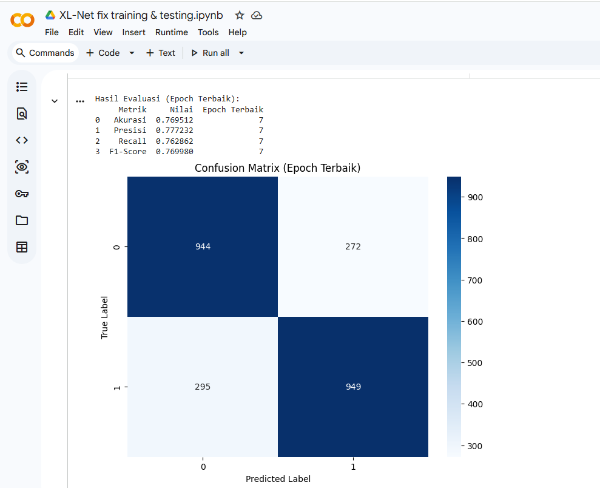
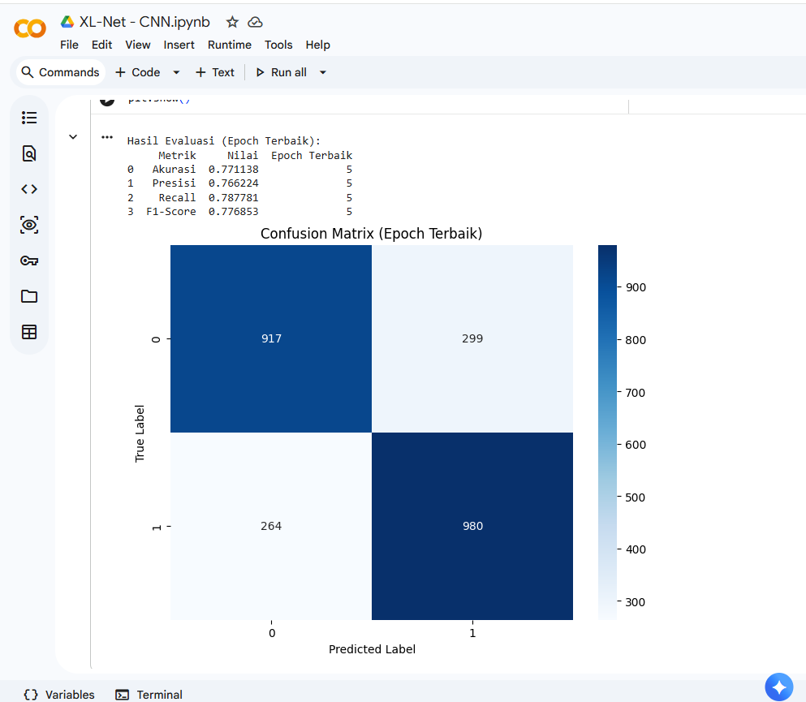
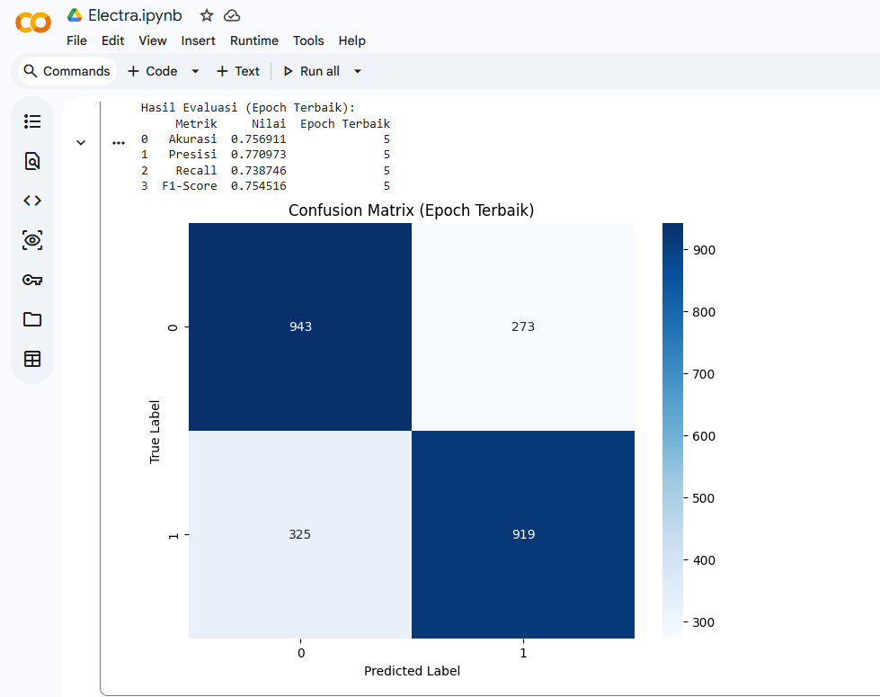
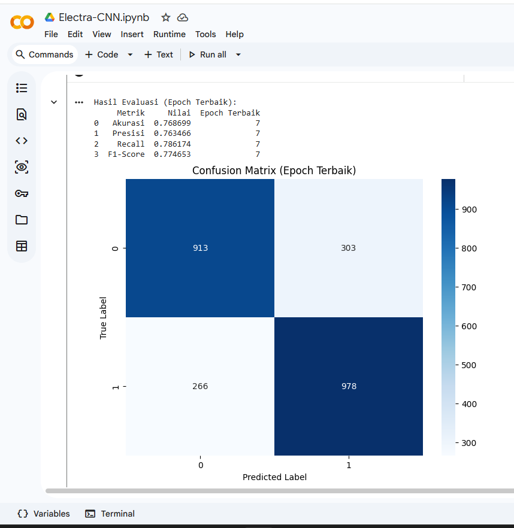

# Cyberbullying Text Classification using XLNet, XLNet-CNN, ELECTRA, and ELECTRA-CNN

## Overview
This project focuses on classifying cyberbullying text using a hybrid deep learning model that combines XLNet and CNN. Then transformer model ELECTRA with deep learning CNN.

## Tools & Technologies
- Python
- TensorFlow / Keras
- NLP
- XLNet
- ELECTRA
- CNN
- Google Colab

## Project Objectives
- Perform text preprocessing
- Train a cyberbullying text classification model
- Evaluate model performance using metrics such as accuracy, precision, recall, and F1-score

## Output Preview

## Open Notebook
[Open in Google Colab for XLNet](https://drive.google.com/file/d/10AxqySQrB5N_nvMRL6tQz-9MfyT5F4Dw/view?usp=sharing)
[Open in Google Colab for XLNet-CNN](https://drive.google.com/file/d/1HerTF08_ZXpIU0J9K4uYXXtIdkT3bhe0/view?usp=sharing)
[Open in Google Colab for ELECTRA](https://drive.google.com/file/d/1ftQA4IKMNnE6jWyWWotoR6fV_IOSZP-f/view?usp=sharing)
[Open in Google Colab for ELECTRA-CNN](https://drive.google.com/file/d/1tdiLS2j9ObsZjphOkrUWH2DIH5Z1aY2T/view?usp=sharing)
